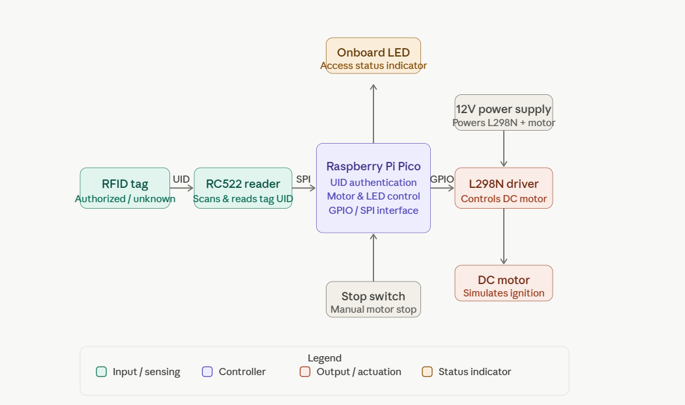
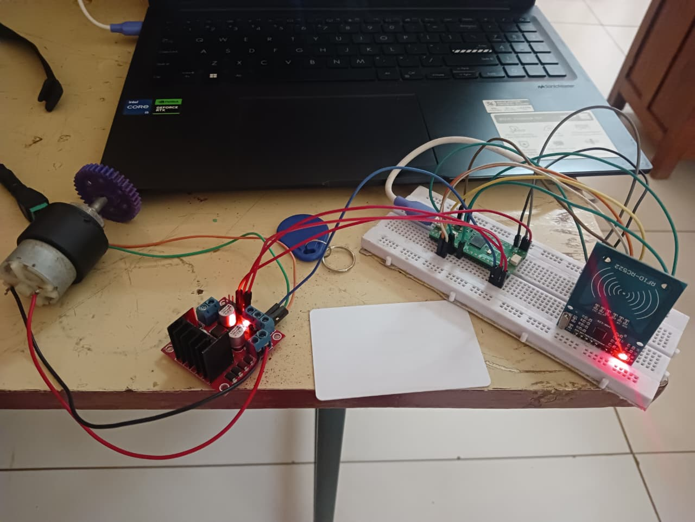

# RFID-Based-Smart-Ignition-System
The project is RFID Based Smart Ignition System, implemented using Raspberry Pi Pico, RC522 RFID, and L298N motor driver, with MATLAB/Simulink simulation and hardware implementation.

## Overview

An embedded automotive security system that uses RFID authentication to control vehicle ignition. The system uses a Raspberry Pi Pico and RC522 RFID module to verify authorized RFID tags before activating a DC motor through an L298N motor driver.

## Key Features

- RFID-based user authentication
- Authorized and unauthorized tag detection
- Motor-based ignition control
- Manual stop switch
- LED status indication
- SPI communication between Pico and RC522
- MATLAB Simulink model for system-level verification

## Hardware

- Raspberry Pi Pico H
- RC522 RFID Module
- RFID Tags
- L298N Motor Driver
- DC Motor
- Push Button
- 12V Adapter

## Software & Tools

- Embedded C / C++
- Arduino IDE
- MATLAB Simulink
- SPI Communication

## Working

RFID Tag → RC522 Reader → Raspberry Pi Pico → UID Verification → Motor Driver → Ignition Motor

An authorized RFID tag activates the motor, while an unauthorized tag keeps the ignition disabled. A manual stop switch is provided to stop the motor when required.

## System Architecture

### Block Diagram

The block diagram shows the overall system architecture, including the MQ-3 gas sensor, STM32 microcontroller, DC motor, and LED indicators.

### Hardware Implementation

The hardware prototype demonstrates the integration of the STM32 microcontroller, MQ-3 gas sensor, DC motor, and LED indicators for fuel leakage detection and engine protection.

## Results

The RFID authentication and motor-control logic were verified through simulation and demonstrated using the hardware implementation.
